# Data Security in IT Systems - Labs Portfolio 

This repository documents my technical journey through the MSc Cybersecurity program.

---

## Lab 01: Social Engineering Attack Lifecycle & Remote Access
*Tools: Kali Linux, MSFVenom, Metasploit (msfconsole), G++, Python HTTP Server*

<b>📂 View Full Project Walkthrough (Manual Payload Prep to Exploitation)</b>

### **Phase 1: Weaponization**
| Step 1: Nano Source Editing | Step 2: MSFVenom Generation | Step 3: Shellcode Embedding |
| :---: | :---: | :---: |
| 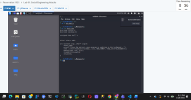 | 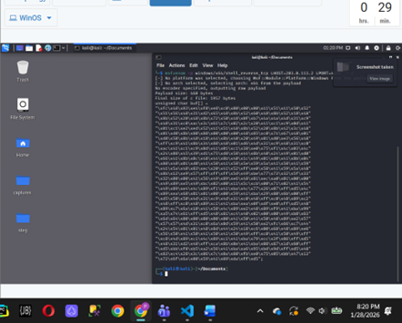 | 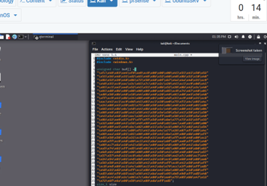 |
| *Defining the C++ buffer* | *Generating Reverse TCP payload* | *Pasting hex into main.cpp* |

### **Phase 2: Delivery & Phishing**
| Step 4: G++ Compilation | Step 5: Python HTTP Server | Step 6: Roundcube Webmail Setup |
| :---: | :---: | :---: |
| 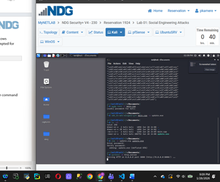 |  | 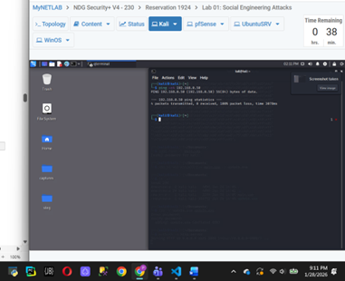 |
| *Creating update.exe* | *Hosting the delivery vector* | *Fake login portal creation* |

### **Phase 3: Exploitation**
| Step 7: Metasploit Handler | Step 8: Target Execution | Step 9: Reverse Shell Success |
| :---: | :---: | :---: |
| 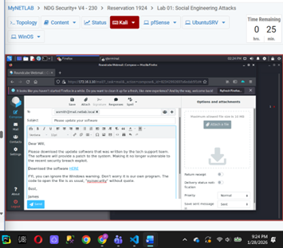 | 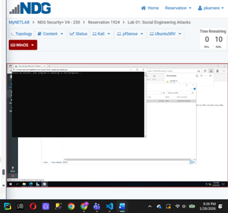 | 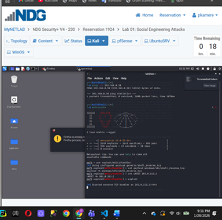 |
| *Configuring LHOST/LPORT* | *User runs update.exe on Win* | *Full CLI access granted* |

**Conclusion:** This lab demonstrated the end-to-end attack chain, proving that user interaction is a critical vulnerability that can be exploited to bypass technical perimeters.

---

##  Lab 02: Host-Based Intrusion Prevention (SSHGuard)
*Tools: Ubuntu Server, SSHGuard, Iptables, Python Attack Scripts*

<b>📂 View Full Project Walkthrough (Automated Brute-Force Mitigation)</b>

### **Phase 1: Defensive Hardening**
| Step 1: Service Verification | Step 2: Systemctl Monitoring |
| :---: | :---: |
| 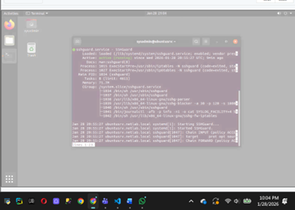 |  |
| *Verifying SSHGuard is active* | *Checking iptables integration* |

### **Phase 2: Attack Simulation**
| Step 3: Python Brute-Force | Step 4: Auth.log Detection |
| :---: | :---: |
| 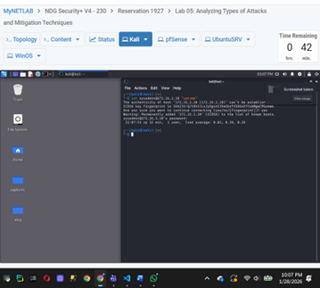 | 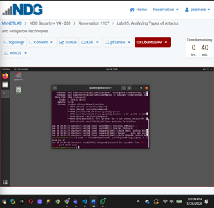 |
| *Simulating rapid SSH attempts* | *SSHGuard identifying the pattern* |

### **Phase 3: Mitigation & Resource Analysis**
| Step 5: Iptables Drop Rules | Step 6: System Stability (Htop) | Step 7: Log Correlation |
| :---: | :---: | :---: |
| 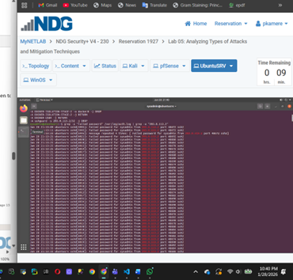 | 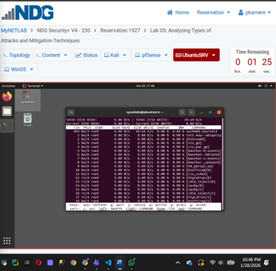 | 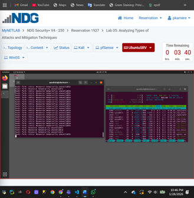 |
| *Malicious IP blocked in firewall* | *Analyzing CPU/RAM under load* | *Matching logs with mitigations* |

**Conclusion:** The lab confirmed that combining real-time log analysis with automated firewall updates successfully neutralizes high-frequency brute-force attacks without impacting system performance.

---

  

  <b>  Stay tuned! More labs on Data Security are on the way.</b> 
  <i>Current Status: MSc Cybersecurity Student | Actively Building & Documenting</i>

  

