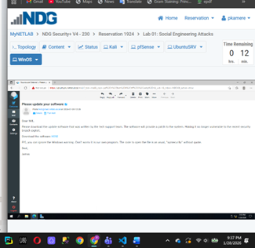
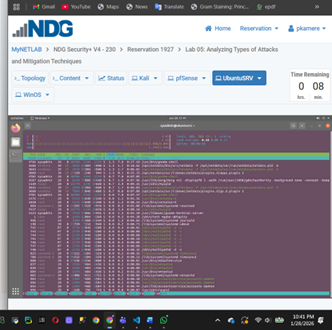

# Data Security in IT Systems - Lab Portfolio 

This repository documents my technical journey through the MSc Cybersecurity program. Each project is contained within a collapsible section—click **"View Project Details"** to see the full technical walkthrough.
----

##  Lab 01: Social Engineering Attack Lifecycle
*Focus: Malware Development, Phishing, and Remote Access*

<b>📂 View Full Technical Walkthrough (9+ Screenshots)</b>

### **Phase 1: Weaponization & Coding**
**1. Source Code Prep:** Editing `main.cpp` in Kali Linux to prepare the malicious character buffer.

**2. Shellcode Generation:** Using `msfvenom` to generate the reverse TCP payload.

**3. Embedding:** Pasting the hex shellcode into the C++ source before compilation.

### **Phase 2: Delivery & Social Engineering**
**4. Compilation & Hosting:** Compiling the exploit into `update.exe` and launching a Python HTTP server to host the file.

**5. Fake Login Portal:** Setting up the Roundcube webmail clone to capture user interest.

**6. The Phishing Email:** Crafting the deceptive message to trigger the download.

### **Phase 3: Exploitation & Control**
**7. Listener Configuration:** Setting up the Metasploit `multi/handler` to wait for the callback.

**8. Target Execution:** The moment the user runs the "update" on the Windows machine.

**9. Remote Access Granted:** Success! Full command-line access established via the reverse shell.

---

##  Lab 02: Host-Based Intrusion Prevention (SSHGuard)
*Focus: Brute-Force Mitigation and Linux Hardening*

<b>📂 View Full Technical Walkthrough (12+ Screenshots)</b>

### **Phase 1: Defensive Setup**
**1. Service Verification:** Confirming **SSHGuard** is active and integrated with `iptables` on the Ubuntu Server.

### **Phase 2: Attack Simulation**
**2. Automated Brute-Force:** Running a Python script from Kali Linux to hammer the SSH port with connection attempts.

**3. Real-Time Detection:** Monitoring the server logs as SSHGuard identifies the rapid-fire authentication failures.

### **Phase 3: Mitigation & Monitoring**
**4. Blocking the Attacker:** Viewing the `iptables` rules automatically generated to drop the attacker's IP.

**5. System Stability:** Monitoring CPU and resource usage to ensure the server remains stable under attack.

**6. Correlation:** Analyzing the logs to correlate the attack timestamps with the defensive actions taken.

*Future documentation for Cloud Security or IoT Labs.*
